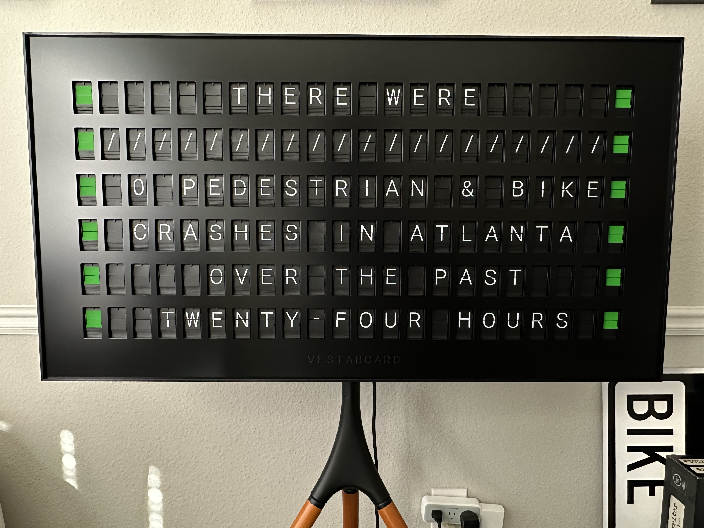
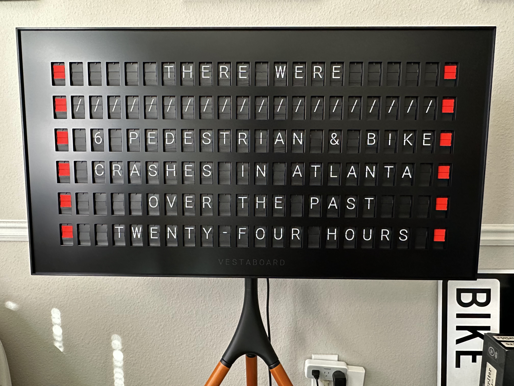

# Pedestrian and Bicyclist Crashes

Based on https://github.com/cailinpitt/Pedestrian-and-bike-crashes - publishes the number of pedestrian and bicyclist crashes found over the last 24 hours on Citizen. Uses the Vestaboard read/write API.

#### Zero Crashes

#### Non-Zero Crashes

## Run
`node index.js --key read-write-api-key`
